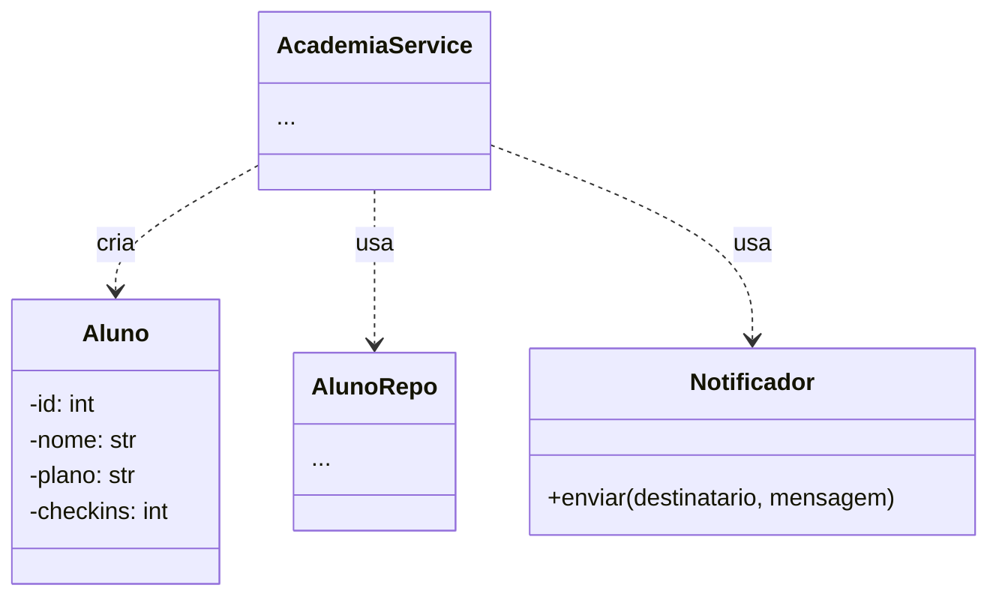

# Diagrama de classes — Academia FitPará (depois do SRP)

**Sua tarefa (Parte 1 da atividade, 0,3):** completar o diagrama de classes em
**Mermaid** com a decomposição em componentes. A sintaxe e um exemplo estão no
roteiro da aula. Substitua os `...` pelas suas respostas e **não apague** as cercas
` ```mermaid `.

> O GitHub desenha Mermaid sozinho: depois de dar `push`, abra este arquivo no
> site e confira se o diagrama aparece **renderizado** (não como texto).



**Dicas do que cada classe guarda/faz** (decida os detalhes você):
- `Aluno` — os dados de um aluno (ex.: `id`, `nome`, `plano`, `checkins`). É uma **dataclass**.
- `AlunoRepo` — guarda e busca os alunos (salvar, buscar por nome, listar, próximo id).
- `Notificador` — envia o aviso ao aluno (já implementado por você no código).
- `AcademiaService` — as **regras**: matricular (calcular o valor do plano), fazer check-in.
